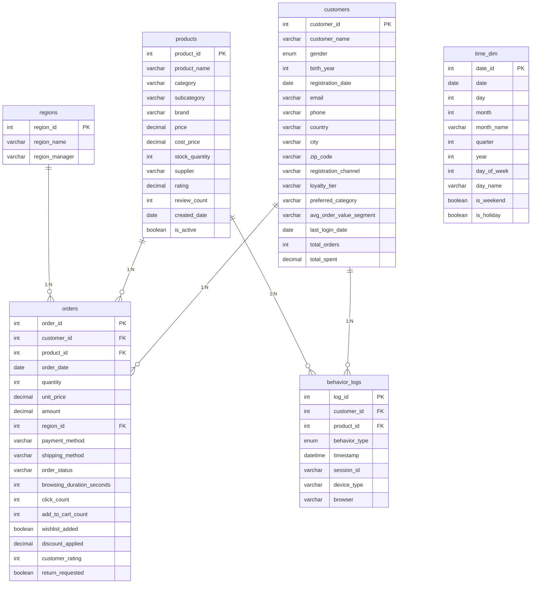

# 电商数据库表结构文档

## 📊 数据库表结构总览

本电商数据库采用星型模型设计，包含6个核心数据表，支持全面的业务分析和用户行为追踪。

---

## 👥 客户维度表 (customers)

**表说明**：存储客户基本信息和用户画像数据

| 字段名 | 数据类型 | 约束 | 说明 | 示例 |
|--------|----------|------|------|------|
| customer_id | INT | PRIMARY KEY | 客户唯一标识符 | 1001 |
| customer_name | VARCHAR(100) | NOT NULL | 客户姓名 | User_1001 |
| gender | ENUM('Male','Female') | - | 性别 | Male |
| birth_year | INT | - | 出生年份 | 1990 |
| registration_date | DATE | - | 注册日期 | 2022-03-15 |
| email | VARCHAR(150) | - | 电子邮箱 | user1001@example.com |
| phone | VARCHAR(20) | - | 手机号码 | 13001234567 |
| country | VARCHAR(50) | - | 国家 | USA |
| city | VARCHAR(50) | - | 城市 | New York |
| zip_code | VARCHAR(10) | - | 邮政编码 | 10001 |
| registration_channel | VARCHAR(50) | - | 注册渠道 | Web |
| loyalty_tier | VARCHAR(20) | - | 忠诚度等级 | Gold |
| preferred_category | VARCHAR(50) | - | 偏好品类 | Electronics |
| avg_order_value_segment | VARCHAR(20) | - | 客单价分段 | High |
| last_login_date | DATE | - | 最后登录日期 | 2024-01-15 |
| total_orders | INT | DEFAULT 0 | 总订单数 | 25 |
| total_spent | DECIMAL(12,2) | DEFAULT 0.00 | 总消费金额 | 12500.50 |

**索引**：
- `idx_country` (country)
- `idx_registration_date` (registration_date)
- `idx_loyalty_tier` (loyalty_tier)
- `idx_preferred_category` (preferred_category)

---

## 🛍️ 商品维度表 (products)

**表说明**：存储商品基础信息和库存数据

| 字段名 | 数据类型 | 约束 | 说明 | 示例 |
|--------|----------|------|------|------|
| product_id | INT | PRIMARY KEY | 商品唯一标识符 | 50 |
| product_name | VARCHAR(200) | NOT NULL | 商品名称 | Smartphone Model 50 |
| category | VARCHAR(50) | - | 商品品类 | Electronics |
| subcategory | VARCHAR(50) | - | 商品子类 | Smartphone |
| brand | VARCHAR(50) | - | 品牌 | BrandA |
| price | DECIMAL(10,2) | - | 销售价格 | 2999.00 |
| cost_price | DECIMAL(10,2) | - | 成本价格 | 1500.00 |
| stock_quantity | INT | - | 库存数量 | 150 |
| supplier | VARCHAR(50) | - | 供应商 | Supplier_5 |
| rating | DECIMAL(3,1) | - | 商品评分 | 4.5 |
| review_count | INT | - | 评价数量 | 120 |
| created_date | DATE | - | 上架日期 | 2023-06-10 |
| is_active | BOOLEAN | - | 是否在售 | TRUE |

**索引**：
- `idx_category` (category)
- `idx_brand` (brand)
- `idx_price` (price)

---

## 📦 订单事实表 (orders)

**表说明**：存储核心交易数据和用户购买行为

| 字段名 | 数据类型 | 约束 | 说明 | 示例 |
|--------|----------|------|------|------|
| order_id | INT | PRIMARY KEY | 订单唯一标识符 | 5001 |
| customer_id | INT | FOREIGN KEY | 客户ID | 1001 |
| product_id | INT | FOREIGN KEY | 商品ID | 50 |
| order_date | DATE | - | 订单日期 | 2024-01-15 |
| quantity | INT | - | 购买数量 | 2 |
| unit_price | DECIMAL(10,2) | - | 商品单价 | 2999.00 |
| amount | DECIMAL(10,2) | - | 订单金额 | 5998.00 |
| region_id | INT | FOREIGN KEY | 地区ID | 1 |
| payment_method | VARCHAR(50) | - | 支付方式 | Credit Card |
| shipping_method | VARCHAR(50) | - | 配送方式 | Express |
| order_status | VARCHAR(20) | - | 订单状态 | Completed |
| browsing_duration_seconds | INT | - | 浏览时长(秒) | 300 |
| click_count | INT | - | 点击次数 | 5 |
| add_to_cart_count | INT | - | 加购次数 | 2 |
| wishlist_added | BOOLEAN | - | 是否加入收藏 | TRUE |
| discount_applied | DECIMAL(5,2) | - | 折扣比例 | 0.10 |
| customer_rating | INT | - | 客户评价(1-5星) | 5 |
| return_requested | BOOLEAN | - | 是否申请退货 | FALSE |

**外键关系**：
- `customer_id` → `customers(customer_id)`
- `product_id` → `products(product_id)`
- `region_id` → `regions(region_id)`

**索引**：
- `idx_order_date` (order_date)
- `idx_customer_id` (customer_id)
- `idx_product_id` (product_id)
- `idx_order_status` (order_status)

---

## ⏰ 时间维度表 (time_dim)

**表说明**：支持时间相关的分析查询

| 字段名 | 数据类型 | 约束 | 说明 | 示例 |
|--------|----------|------|------|------|
| date_id | INT | AUTO_INCREMENT PRIMARY KEY | 日期唯一标识 | 1 |
| date | DATE | UNIQUE | 完整日期 | 2024-01-15 |
| day | INT | - | 日(1-31) | 15 |
| month | INT | - | 月(1-12) | 1 |
| month_name | VARCHAR(20) | - | 月份名称 | January |
| quarter | INT | - | 季度(1-4) | 1 |
| year | INT | - | 年份 | 2024 |
| day_of_week | INT | - | 星期几(0-6) | 1 |
| day_name | VARCHAR(20) | - | 星期名称 | Monday |
| is_weekend | BOOLEAN | - | 是否周末 | FALSE |
| is_holiday | BOOLEAN | - | 是否节假日 | FALSE |

**索引**：
- `idx_date` (date)
- `idx_year_month` (year, month)

---

## 🌍 地区维度表 (regions)

**表说明**：存储地域分布信息

| 字段名 | 数据类型 | 约束 | 说明 | 示例 |
|--------|----------|------|------|------|
| region_id | INT | PRIMARY KEY | 地区唯一标识 | 1 |
| region_name | VARCHAR(50) | NOT NULL | 地区名称 | North America |
| region_manager | VARCHAR(50) | - | 区域经理 | Manager_A |

---

## 🎯 用户行为日志表 (behavior_logs)

**表说明**：记录用户与商品的交互行为

| 字段名 | 数据类型 | 约束 | 说明 | 示例 |
|--------|----------|------|------|------|
| log_id | INT | PRIMARY KEY | 日志唯一标识 | 100001 |
| customer_id | INT | FOREIGN KEY | 客户ID | 1001 |
| product_id | INT | FOREIGN KEY | 商品ID | 50 |
| behavior_type | ENUM | - | 行为类型 | view |
| timestamp | DATETIME | - | 时间戳 | 2024-01-15 14:30:25 |
| session_id | VARCHAR(50) | - | 会话ID | session_1234 |
| device_type | VARCHAR(20) | - | 设备类型 | Mobile |
| browser | VARCHAR(20) | - | 浏览器 | Chrome |

**外键关系**：
- `customer_id` → `customers(customer_id)`
- `product_id` → `products(product_id)`

**索引**：
- `idx_customer_behavior` (customer_id, behavior_type)
- `idx_timestamp` (timestamp)
- `idx_product_behavior` (product_id, behavior_type)

---

## 🔗 表关系图

---

## 📈 数据规模统计

| 表名 | 记录数 | 主要用途 | 更新频率 |
|------|--------|----------|----------|
| customers | 5,000 | 用户画像分析 | 低频更新 |
| products | 200 | 商品管理 | 中频更新 |
| orders | 50,000 | 交易分析 | 高频更新 |
| behavior_logs | 100,000 | 用户行为分析 | 实时更新 |
| regions | 6 | 地域分析 | 低频更新 |
| time_dim | 1,096 | 时间分析 | 一次性生成 |

